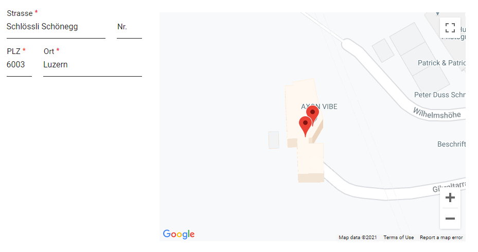

# Google Maps Konnektor

Der [Google Maps](https://developers.google.com/maps/documentation/javascript/overview) Konnektor von Axon Ivy ermöglicht die Anpassung von Karten mit eigenen Inhalten und Bildern für die Anzeige auf Webseiten und mobilen Endgeräten.

Der Konnektor:

- gewährt Zugriff auf die Core-API der Google Maps Platform
- bietet vier grundlegende Kartentypen (Straßenkarte, Satellit, Hybrid und Gelände), die du mithilfe von Layern, Stilen, Steuerungen, Ereignissen sowie verschiedenen Diensten und Bibliotheken anpassen kannst.


## Demo

1. This is a demo for Axon Ivy's Google Maps API connector


## Setup

1. Create a new [Google API key](https://developers.google.com/maps/documentation/javascript/get-api-key#creating-api-keys)
2. Copy the API Key into your `variables.yaml`.

```
Variables:

  google.map.api.key: 'your api key'
```

