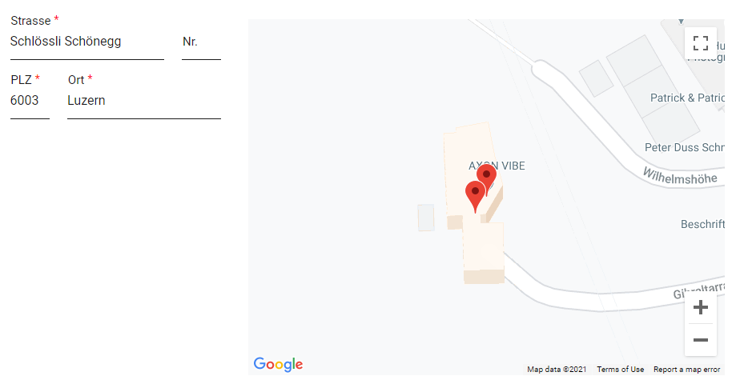

# #Google #kartographieren Anschluss
#Axon Efeus [#Google #Kartographieren
API](https://developers.google.com/maps/documentation/javascript/overview)
erlaubt du zu anpassen Landkarten mit eurem eigenen Inhalt für Display auf
Web-Seiten und mobile Vorrichtungen.

Der Anschluss:

- Versieht vier einfache Landkarte Typen (#Entwicklungsplan, Satellit,
  Mischform, und Gelände) #welche du kannst modifizieren benutzen schichtest und
  stylst, Aufsichten und Ereignisse, und verschiedene Bedienungen und
  Bibliotheken
- Versieht Zugang zu dem Innenteil API von #Google #Kartographieren Bahnsteig

## Demo

1. Dies ist eine Demo für #Axon Efeus #Google #Kartographieren API Anschluss
   

## Einrichtung

1. Schaff ein neues [#Google API
   Schlüssel](https://developers.google.com/maps/documentation/javascript/get-api-key#creating-api-keys)
2. Kopier das API Schlüssel hinein eure `Variablen.yaml`.

```
Variables:

  google.map.api.key: 'your api key'
```
